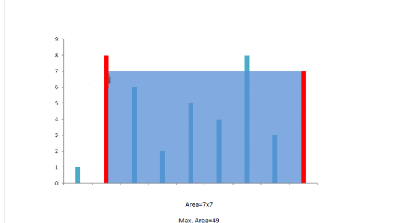
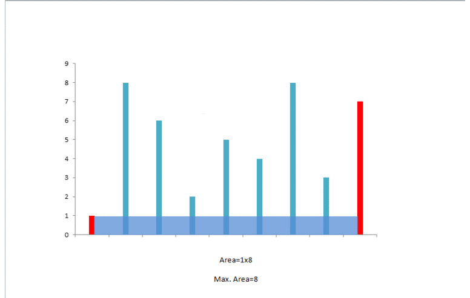

11.Container With Most Water

Given *n* non-negative integers *a1*, *a2*, ..., *an* , where each represents a point at coordinate (*i*, *ai*). *n* vertical lines are drawn such that the two endpoints of line *i* is at (*i*, *ai*) and (*i*, 0). Find two lines, which together with x-axis forms a container, such that the container contains the most water.

**Note:** You may not slant the container and *n* is at least 2.



The above vertical lines are represented by array [1,8,6,2,5,4,8,3,7]. In this case, the max area of water (blue section) the container can contain is 49.

 

**Example:**

```visual basic
Input: [1,8,6,2,5,4,8,3,7]
Output: 49
```


**题意**：给定一系列非负数，假设为高度，计算能装最多水的区域。

**我的解法**：

蛮力法，时间复杂度：$\ O(n^2)$ 计算为$\ \frac{n(n-1)}{n}$，空间复杂度：$\ O(1)$

```c++
class Solution {
public:
    int maxArea(vector<int>& height) {
        //使用遍历依次计算两个高度之间的area，找到最大值
        int max =0;
        int len = height.size();
        int hei=0;
        int are=0;
        for(int i=0;i<len;i++)
        {
            for(int j=i+1;j<len;j++) //使用j=i+1,避免一般的循环
            {   
                hei = height[i];
                if(height[i]>height[j]) hei = height[j]; //判断高
                are = (j-i)*hei;//计算两者的面积
                if(are>max) max=are;
                    
            }
        }
        return max;
        
    }
};
```

**官方解法**：两指针逼近。时间复杂度：$\ O(n)$ ，空间复杂度：$\ O(1)$

这种方法背后的直觉是，线之间形成的区域总是受短线高度的限制。此外，越远的线，获得的区域就越多。 我们取两个指针，一个在开头，一个在构成行长度的数组的末尾。因此，我们维护一个变量maxarea最大区域，以存储到现在获得的最大区域。在每一步中，我们找出它们之间形成的区域，更新 maxarea，并将指向较短的线的指针向另一端移动一个步骤。



```java
public class Solution {
    public int maxArea(int[] height) {
        int maxarea = 0, l = 0, r = height.length - 1;
        while (l < r) {
            maxarea = Math.max(maxarea, Math.min(height[l], height[r]) * (r - l));
            if (height[l] < height[r])
                l++;
            else
                r--;
        }
        return maxarea;
    }
}
```